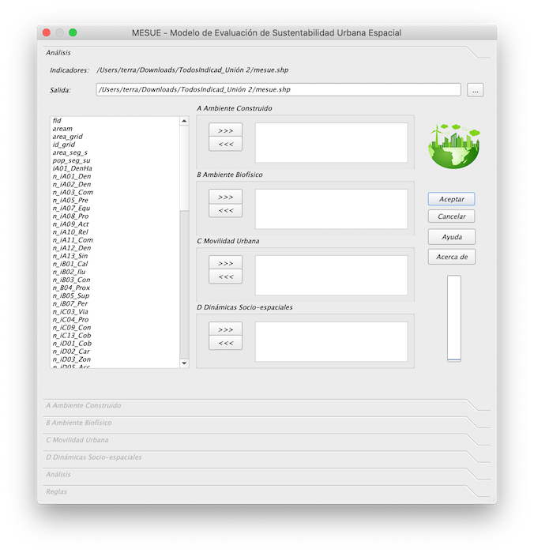

================================================================
MESUE
================================================================

MESUE es un complemento QGIS para la evaluación de la sostenibilidad urbana en el entorno geográfico, utilizando criterios de ambiente construido, ambiente biofísico, movilidad urbana y dinámicas socio-espaciales. Los resultados de MESUE son geográficos. La herramienta es open-source y puede ser utilizada de forma libre por investigadores, técnicos, estudiantes, planificadores y ciudadanía en general. 

Basado en la herramienta `SSAM <https://github.com/gmassei/SSAM>`_ (Spatial Sustainability Assessment Model).

Requisitos
------------------------------

MESUE - Modelo de Evaluación de Sustentabilidad Urbano Espacial, es un complemento que se instala el programa de sistemas de información geográfico QGIS 3.10.2 o superior. `Sitio para descargar <https://www.qgis.org/es/site/forusers/download.html>`_

Instalación
------------------------------

Descargue el complemento MESUE haciendo click `aquí <https://github.com/llactalab/mesue/raw/master/mesue.zip>`_, luego agregue a sus complementos de QGIS. El complemento se agregará a la "Caja de herramientas de procesos". El complemento se agregará a la "Barra de herramientas" de QGIS con el siguiente logo: 

Al abrir se nos presentará la siguiente pantalla donde se prodrá seleccionar los indicadores que se quieran evaluar.

